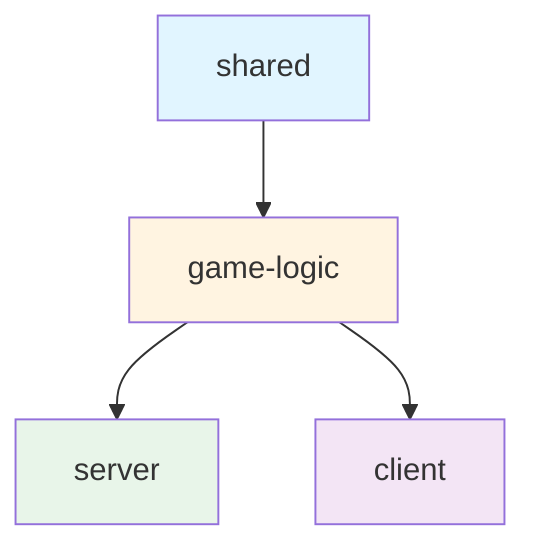

# 项目架构规范

## 2.1 项目概览

Tabletopia 是在线多人对战桌游平台，采用 Monorepo 架构，每个游戏是独立子项目，有一个 Portal 聚合首页提供游戏入口导航。

## 2.2 Monorepo 架构

项目使用 npm workspaces 管理，每个游戏是独立的 npm workspace。根目录包含以下内容：

- `portal/` - 聚合首页项目
- `azul/` - Azul 游戏子项目
- `splendor-duel/` - Splendor Duel 游戏子项目
- `lost_cities/` - Lost Cities 游戏子项目
- `run.sh` - 启动脚本
- `stop.sh` - 停止脚本
- `docs/` - 项目文档目录
- `README.md` - 项目说明文档

## 2.3 四层分包架构

每个游戏子项目采用四层分包架构，使用 npm workspaces 管理：

### 分包说明

- **shared**: 共享类型定义与常量
  - 无外部依赖
  - 纯 TypeScript 类型和常量
  - 可被其他三个包依赖

- **game-logic**: 游戏逻辑引擎
  - 纯函数实现
  - 依赖 shared
  - 不依赖任何 Node.js 或浏览器 API
  - 核心游戏逻辑实现

- **server**: WebSocket 服务端
  - 依赖 shared 和 game-logic
  - 使用 Express + Socket.IO
  - 处理客户端连接和游戏状态管理

- **client**: React 客户端
  - 依赖 shared 和 game-logic
  - 使用 React + Vite + Zustand
  - 提供游戏界面和用户交互

### 依赖关系图



## 2.4 Portal 聚合层

Portal 是独立的 Vite + React 项目，作为项目的聚合入口：

- 运行在端口 4000
- 提供所有游戏的入口导航
- 通过超链接跳转到各游戏的 client 端口
- 使用数据驱动方式管理游戏列表（games 数组）

### 游戏列表配置

Portal 通过 `games` 数组管理所有游戏，每个游戏包含：
- 游戏名称
- 游戏描述
- Client 端口
- Server 端口
- 游戏封面图片等

## 2.5 端口分配规则

### 端口分配原则

- **Portal**: 固定端口 4000
- **游戏端口**: 从 3000 起步，每个游戏占用 2 个连续端口
  - Client 端口：偶数（3000, 3002, 3004, ...）
  - Server 端口：奇数（3001, 3003, 3005, ...）

### 当前端口分配

| 游戏 | Client 端口 | Server 端口 |
|------|-------------|-------------|
| Azul | 3000 | 3001 |
| Splendor Duel | 3002 | 3003 |
| Lost Cities | 3004 | 3005 |

### 新游戏端口分配

新游戏按顺序递增分配端口，例如：
- 第 4 个游戏：Client 3006, Server 3007
- 第 5 个游戏：Client 3008, Server 3009

## 2.6 通信架构

### WebSocket 通信

客户端与服务端通过 WebSocket 实时通信：

- **推荐方案**: Socket.IO
  - 支持自动重连
  - 内置心跳检测
  - ACK 确认机制
  - 跨浏览器兼容性好

- **可选方案**: 原生 WebSocket
  - 更轻量级
  - 适用于简单场景（如 Lost Cities）

### 通信模式

```
客户端发送动作 → 服务端处理 → 广播状态更新
```

1. 客户端发送游戏动作（如出牌、移动等）
2. 服务端验证动作合法性
3. 服务端更新游戏状态
4. 服务端广播新状态给所有客户端
5. 客户端渲染更新后的游戏状态

### 房间机制

- 玩家可以创建房间或加入房间
- 服务端管理房间状态和玩家列表
- 每个房间维护独立的游戏状态
- 支持房间内实时消息广播

## 2.7 启动与部署

### 启动脚本 (run.sh)

`run.sh` 脚本功能：

- 自动发现所有游戏目录
- 启动 Portal 和所有游戏
- 支持 `--select` 参数交互式选择单个游戏启动
- 自动安装依赖（如 node_modules 不存在）

使用方式：
```bash
./run.sh              # 启动所有项目
./run.sh --select     # 交互式选择启动
```

### 停止脚本 (stop.sh)

`stop.sh` 脚本功能：

- 停止所有游戏进程
- 支持 `--select` 参数交互式选择要停止的进程

使用方式：
```bash
./stop.sh             # 停止所有进程
./stop.sh --select    # 交互式选择停止
```

### 依赖管理

- 启动脚本会自动检查 node_modules 是否存在
- 如不存在，自动执行 `npm install` 安装依赖
- 使用 npm workspaces 统一管理依赖
